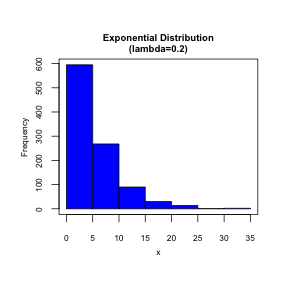
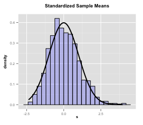

# Exponential Distribution and the Central Limit Theorem
### Author: Grace Tenorio
 
 
 
## Overview
In this analysis, we will look at the distribution of means of 40 exponentials in the context of the Central Limit Theorem.  The goal is to illustrate that the distribution of means of independent and identically distributed random variables becomes that of a standard normal as the sample size increases.  In particular, the sample means have the following distribution: $\bar X_n$ ~ $N$($\mu$,$\sigma$$^2$/$n$)


## The Exponential Distribution
To gain an understanding of what the exponential distribution with lamdba=0.2 looks like, we generate 1000 random exponentials and plot them.  
  
  
 

By definition, the mean and standard deviation of the exponential distribution are both equal to 1/lambda.  Therefore, for lambda=0.2, the mean and standard deviation are both equal to 5.


## Simulation
First, we generate 40 random exponentials with lambda=0.2 and take their mean.  We then repeat this process 1000 times.  At the end of this simulation, we end up with a vector of 1000 sample means.


```r
set.seed(10)
means = NULL
for (i in 1:1000) { means = c(means, mean(rexp(40,0.2))) }
```


## Sample Mean vs Theoretical Mean
We compute the mean of the vector of sample means:


```r
mean(means)
```

```
## [1] 5.04506
```

As per the Central Limit Theorem, the theoretical mean of the distribution of sample means is $\mu$, the population mean.  By definition, we know this to be 1/lambda = 1/0.2 = 5.  Therefore, the sample mean is approximately equal to the theoretical mean.


## Sample Variance vs Theoretical Variance
We compute the variance of the vector of sample means:


```r
var(means)
```

```
## [1] 0.6372544
```

As per the Central Limit Theorem, the theoretical variance of the distribution of sample means is $\sigma^2/n$, where $\sigma^2$ is the population variance and n=40 is the sample size .  By definition, we know the population variance is (1/lambda)^2 = (1/0.2)^2 = 25.  Therefore the theoretical variance of the distribution of sample means is 25/40 = 0.625.  The sample variance computed above is approximately equal to this theoretical variance.


## Distribution
To show that the distribution of sample means becomes that of a standard normal, we standardize our vector of sample means using the following equation: 
($\sqrt n$ * ($\bar X$-$\mu$)) /$\sigma$


```r
s <- (sqrt(40)*(means - 5))/5
```

By the Central Limit Theorem, the distribution of standardized means should look like that of the standard normal distribution.  We plot the vector of standardized means to illustrate this.

 

As can be seen, the distribution of standardized sample means is approximately that of the standard normal distribution.


## Conclusion
In summary, we conclude the following about the distribution of sample means of 40 exponentials with lambda=0.2:

* its mean is approximately equal to the population mean, $\mu$
* its variance is approximately equal to the population variance, $\sigma$$^2$/$n$
* its distribution approximates that of the standard normal distribution


\newpage
 
## Appendix

```r
set.seed(10)
x <- rexp(1000,0.2)

hist(x, col="blue", xlab=NA, ylab=NA, axes=FALSE, main=NULL)
title("Exponential Distribution\n(lambda=0.2)", cex.main=0.8, line=0.5)
axis(side=1, cex.axis=0.7)
axis(side=2, cex.axis=0.7)
mtext(side=1, text="x", line=2, cex=0.7)
mtext(side=2, text="Frequency", line=2, cex=0.7)
box()
```


```r
library(ggplot2)
s2 <- as.data.frame(s)

g <- ggplot(s2, aes(x = s)) + xlab("s") + ggtitle("Standardized Sample Means")
g <- g + theme(title=element_text(size=8, face="bold", vjust=2), 
               axis.title=element_text(size=8, vjust=1),
               axis.text.x=element_text(size=7),
               axis.text.y=element_text(size=7))
g <- g + geom_histogram(alpha=.20, binwidth=.3, color="black", fill="blue", aes(y = ..density..))  
g <- g + stat_function(fun=dnorm, size=1)
g
```

